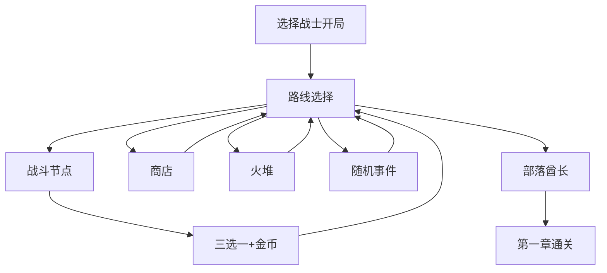

# 《VibeGame》MVP 第一章垂直切片

> **文档状态**：草案 v1.0  
> **Layer**：Polish  
> **Priority**：MVP  
> **关联总案**：[`../游戏粗略策划案.md`](../游戏粗略策划案.md)

## Summary

本文件是 **MVP 第一章** 的单一真相源：参照游戏取舍、In/Out 边界、必须实现的状态与地形、数值锚点与验收标准。Feature 层具体内容见各系统子文档；实现与测试以本文为准。

## 1. 参照游戏与取舍

| 维度 | 杀戮尖塔 | 斗技场的阿丽娜 | 本项目 MVP 取舍 |
| --- | --- | --- | --- |
| 路线 | 分支地图、节点类型固定 | 关卡式推进、网格站位核心 | 保留 StS 式 `10×4` 与节点类型；**空间决策**向阿丽娜看齐（六边形移动与出牌同权） |
| 火堆 | 回血 / 升牌 /（铁匠） | 休息恢复 | MVP：**回血 + 升牌二选一**；铁匠/合成延后 |
| 商人 | 卡牌、删牌、药水 | 有限商店 | MVP：**6 格卡牌 + 删牌服务**；装备/附魔/地形道具延后 |
| 事件 | 大事件池、长期风险 | 较少 | MVP：**5 个第一章事件** + 地图权重；全池扩展 Post-MVP |
| 战斗奖励 | 三选一卡牌 + 金币 | 技能/装备 pick | MVP：**三选一战士牌** + 金币；精英提高稀有权重 |

**不照搬边界**

- 无 StS 遗物层：MVP 不做独立遗物系统。
- 敌人用「牌组 + 公开意图」，而非 StS 固定行为树。
- 地形/改装为本作差异化；MVP 以 **武器切换 + 2H 撞墙收束** 为核心 subset。
- MVP 阶段 **不做联机**；单人战士闭环优先，合作模式 Post-MVP。

## 2. MVP In / Out 清单

### 2.1 纳入 MVP

| 模块 | 内容 |
| --- | --- |
| 职业 | 仅战士；见 [`Feature-战士.md`](../职业系统/战士/Feature-战士.md) 及体系文档 |
| 冒险 | 第一章 `10×4` 路线；普通/精英/首领战斗 + 商店 + 火堆 + 事件 |
| 敌人 | 2 普通（哥布林、投矛哥布林）+ 1 精英（哥布林队长）+ 1 章首领（部落酋长） |
| 奖励 | 战斗三选一 + 金币；商店买牌/删牌；火堆回血或升牌；5 个事件 |
| 地形 | 普通地面、墙体/残骸、深坑；破坏墙体、撞墙额外伤害 |
| 状态 | 见 §3（7 种必须实现） |
| 模式 | 单人 |

### 2.2 Post-MVP（明确不做）

- 骑士、德鲁伊及第二/三章完整内容
- 副职业奖励、工作台合成、附魔、情报服务、大量地形道具
- 水域/电场/感电连锁、火焰传播、动态天气
- 联机合作、Host 迁移、公开匹配
- Foundation 状态表中标注为 `延后` 的全部状态

## 3. MVP 必须实现的状态

| 状态 | Layer | MVP | 触发来源（第一章） |
| --- | --- | --- | --- |
| 力量 | 增益 | 必须 | 哥布林/队长；状态「战吼」/烧血；事件 E02 |
| 格挡 | 增益 | 必须 | 中性「防御」；1H-B 武器被动 |
| 稳固 | 增益 | 必须 | 敌人；切换至 2H 撞墙 counter |
| 流血 | 减益 | 必须 | 状态；2H-S 武器被动 |
| 易伤 | 减益 | 必须 | 状态「烙印」；事件 E02 |
| 束缚 | 减益 | 必须 | 哥布林队长 |
| 燃烧 | 减益 | 必须 | 状态「燃刃」 |

**MVP 禁止引用**：感电及 Foundation 表中其余未标 `必须` 的状态。完整分级见 [`../状态效果系统/Foundation-增益状态.md`](../状态效果系统/Foundation-增益状态.md)、[`../状态效果系统/Foundation-减益状态.md`](../状态效果系统/Foundation-减益状态.md) 的 `MVP` 列。

## 4. MVP 必须实现的地形与改装

| 内容 | MVP | 说明 |
| --- | --- | --- |
| 普通地面 | 必须 | 默认战场底色 |
| 墙体/残骸 | 必须 | 阻挡位移；可破坏 |
| 深坑 | 必须 | 击退/撞墙落点高额伤害 |
| 破坏墙体 | 必须 | 武器切换「破墙」等 |
| 撞墙额外伤害 | 必须 | 武器切换猛冲 + 2H-B 被动 |
| 生成墙体 | 延后 | 无 MVP 战士牌硬依赖 |
| 临时覆盖（火焰/电场等） | 延后 | 燃烧由卡牌直接施加 |
| 水域、高台、植物地、泥沼 | 延后 | 第二章及以后 |

详见 [`../地形系统/Feature-地形与地形改装规则.md`](../地形系统/Feature-地形与地形改装规则.md) §3.1.1。

## 5. 数值锚点（原型假设）

| 项目 | 假设值 | 文档 |
| --- | --- | --- |
| 战士初始生命 | 70 | 战士条目 |
| 火堆回血 | 最大生命 30%（向下取整） | 休息处 Content |
| 删牌价格 | 75 金币 | 商店 Content |
| 普通卡牌商店价 | Common 50 / Uncommon 75 | 商店 Content |
| 普通战金币 | 15–20 | 本文 + 平衡验证 |
| 精英战金币 | 35–45 | 本文 + 平衡验证 |
| 首领战金币 | 95–110 | 本文 + 平衡验证 |
| 全章事件入口 | 3–5 次（权重见节点文档） | 节点 Content |

调参记录见 [`Polish-原型数值与测试观察点.md`](Polish-原型数值与测试观察点.md)。

## 6. 第一章闭环流程

## 7. 下游文档索引

| 系统 | 文档 |
| --- | --- |
| 节点池 | [`../冒险系统/Feature-节点与服务设计.md`](../冒险系统/Feature-节点与服务设计.md) |
| 章节主题 | [`../冒险系统/Feature-章节主题设计.md`](../冒险系统/Feature-章节主题设计.md) |
| 商店/事件/休息 | [`../奖励成长系统/Feature-商店与服务设计.md`](../奖励成长系统/Feature-商店与服务设计.md)、[`../奖励成长系统/Feature-事件收益设计.md`](../奖励成长系统/Feature-事件收益设计.md)、[`../奖励成长系统/Feature-休息处成长设计.md`](../奖励成长系统/Feature-休息处成长设计.md) |
| 遭遇 | [`../遭遇系统/Feature-遭遇与原型战斗设计.md`](../遭遇系统/Feature-遭遇与原型战斗设计.md) |
| 敌人 | [`../敌人系统/Feature-哥布林.md`](../敌人系统/Feature-哥布林.md)、[`Feature-投矛哥布林.md`](../敌人系统/Feature-投矛哥布林.md)、[`Feature-哥布林队长.md`](../敌人系统/Feature-哥布林队长.md)、[`Feature-部落酋长.md`](../敌人系统/Feature-部落酋长.md) |
| 战士 | [`../职业系统/战士/Feature-战士.md`](../职业系统/战士/Feature-战士.md) |
| 战士卡牌体系 | [`Feature-战士武器系统.md`](../职业系统/战士/Feature-战士武器系统.md)、[`Feature-战士体系联动.md`](../职业系统/战士/Feature-战士体系联动.md) 及四体系文档 |
| 测试 | [`Polish-原型数值与测试观察点.md`](Polish-原型数值与测试观察点.md) |

## 8. 验收标准

- **GIVEN** 新局选择战士，**WHEN** 沿第一章路线推进，**THEN** 可经历至少 1 次商店、1 次火堆、1 次事件，并完成章首领战。
- **GIVEN** 任意 MVP 卡牌/敌人/事件，**WHEN** 查 Foundation 状态表，**THEN** 不引用 `MVP=延后` 状态。
- **GIVEN** 第一章战斗，**WHEN** 查地形池，**THEN** 仅出现 §4 列出的基础地形与改装。
- **GIVEN** MVP 构建，**WHEN** 进入职业选择，**THEN** 仅战士可选；联机入口不可用或隐藏。
- **GIVEN** 设计文档，**WHEN** 内链扫描，**THEN** 无断链、无「三职业 MVP」残留表述。
